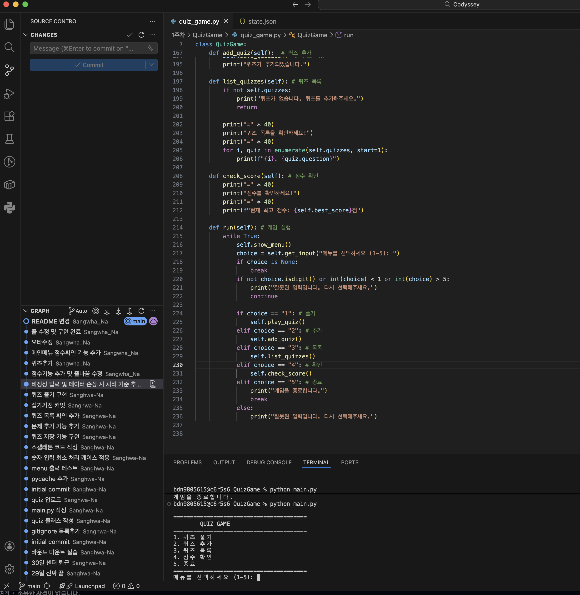
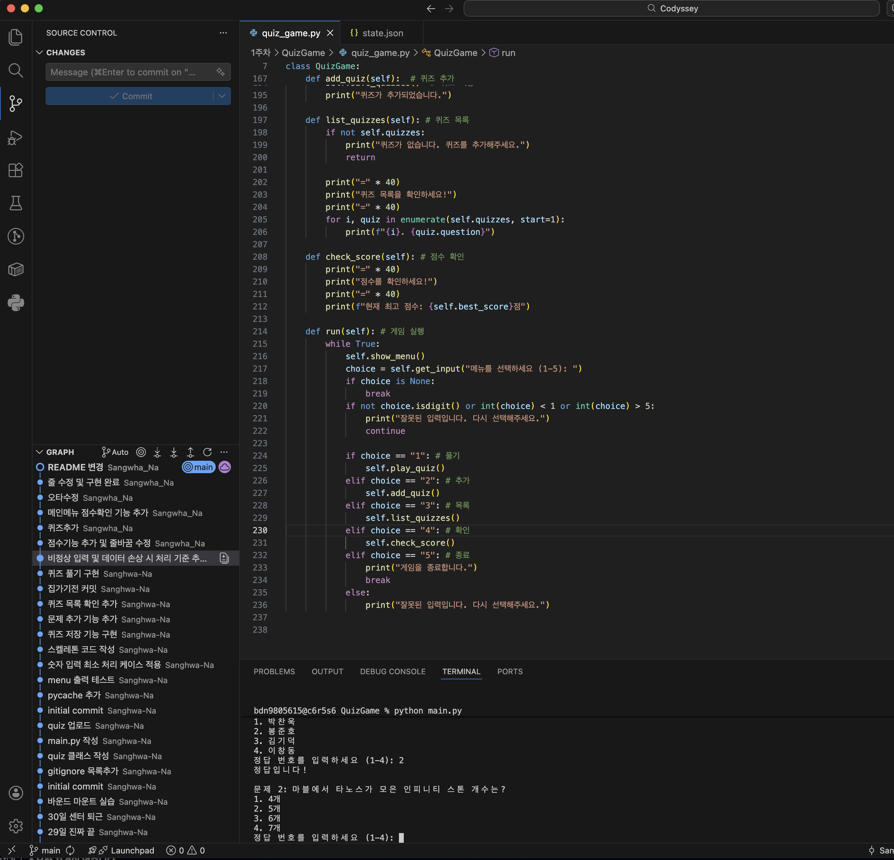
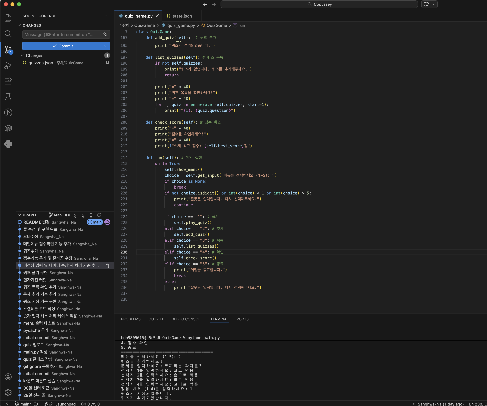
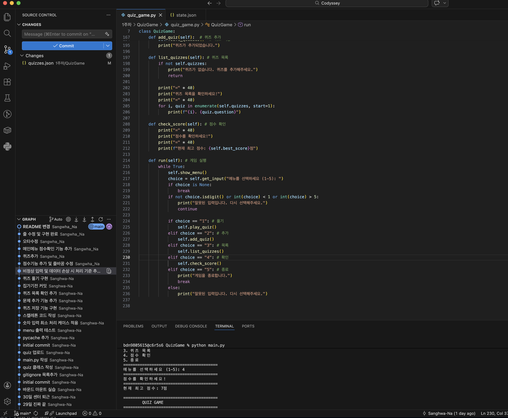

# 나만의 영화 퀴즈 게임

## 프로젝트 개요
Python으로 만든 터미널 기반 영화 퀴즈 게임입니다. 메뉴를 통해 퀴즈를 풀거나 새로운 퀴즈를 추가할 수 있으며, 최고 점수는 파일에 저장되어 재시작 후에도 유지됩니다.

## 퀴즈 주제 선정 이유
**영화**를 선택한 이유:
- 누구나 쉽게 접근 가능한 친숙한 주제
- 다양한 질문 구성 가능 (감독, 배우, 줄거리, 시리즈 등)
- 흥미로운 학습 경험 제공

## 실행 방법
```bash
python main.py
```

## 기능 목록
1. **퀴즈 풀기** - 저장된 퀴즈를 순서대로 풀고 점수 획득
2. **퀴즈 추가** - 새로운 퀴즈 등록 (문제, 선택지, 정답)
3. **퀴즈 목록** - 등록된 모든 퀴즈 확인
4. **점수 확인** - 현재 최고 점수 확인
5. **종료** - 프로그램 종료

## 파일 구조
```
├── main.py          # 프로그램 시작점
├── quiz_game.py     # QuizGame 클래스
├── Quiz.py          # Quiz 클래스
├── quizzes.json     # 퀴즈 데이터
├── state.json       # 최고 점수
├── menu.png         # 메뉴 화면 스크린샷
├── play.png         # 퀴즈 플레이 스크린샷
├── add_quiz.png     # 퀴즈 추가 스크린샷
├── score.png        # 점수 확인 스크린샷
└── README.md        # 이 파일
```

## 실행 화면 스크린샷

### 1. 메뉴 화면


### 2. 퀴즈 풀기 화면


### 3. 퀴즈 추가 화면


### 4. 점수 확인 화면


## 데이터 파일 설명

### state.json
**경로**: 프로젝트 루트  
**역할**: 최고 점수 저장  
**스키마**:
```json
{
    "score": 5
}
```
- `score`: 달성한 최고 점수

### quizzes.json
**경로**: 프로젝트 루트  
**역할**: 모든 퀴즈 데이터 저장  
**스키마**:
```json
[
    {
        "question": "영화 '기생충'의 감독은?",
        "choices": ["박찬욱", "봉준호", "김기덕", "이창동"],
        "answer": 2
    }
]
```
- `question`: 문제
- `choices`: 선택지 4개
- `answer`: 정답 번호 (1~4)