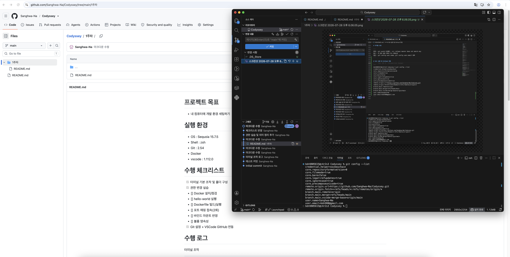

# 프로젝트 목표
- 내 컴퓨터에 개발 환경 세팅하기

# 실행 환경
- OS : Sequoia 15.7.5
- Shell : zsh
- Git : 2.54
- Docker 
- vscode : 1.112.0

# 수행 체크리스트
- [x] 터미널 기본 조작 및 폴더 구성
- [x] 권한 변경 실습
- [x] Docker 설치/점검
- [x] hello-world 실행
- [] Dockerfile 빌드/실행
- [] 포트 매핑 접속(2회)
- [] 바인드 마운트 반영
- [] 볼륨 영속성
- [x] Git 설정 + VSCode GitHub 연동

# 수행 로그
터미널 조작

``` 
bdn9805615@c4r2s3 Codyssey % pwd 
/Users/bdn9805615/Documents/Codyssey 
```

``` 
bdn9805615@c4r2s3 Codyssey % ls -a 
 .		..		.git		1주차		README.md 
 ```

```
bdn9805615@c4r2s3 ~ % ls  
Desktop		Downloads	Movies		Pictures
Documents	Library		Music		Public
bdn9805615@c4r2s3 ~ % cd Documents 
```

```
bdn9805615@c4r2s3 Documents % mkdir test
bdn9805615@c4r2s3 Documents % ls
Codyssey	test
```

```
bdn9805615@c4r2s3 test % touch test.md
bdn9805615@c4r2s3 test % ls
test.md	test3
```

```
bdn9805615@c4r2s3 test % cp test.md test3
bdn9805615@c4r2s3 test % cd test3 
bdn9805615@c4r2s3 test3 % ls
test.md
```

```
bdn9805615@c4r2s3 test % mv test.md test3
bdn9805615@c4r2s3 test % ls
test3
```

```
bdn9805615@c4r2s3 test3 % cat test.md 
test%  
```

```
bdn9805615@c4r2s3 test3 % rm test.md 
bdn9805615@c4r2s3 test3 % ls
```

```
bdn9805615@c4r2s3 Documents % rm -r test2
bdn9805615@c4r2s3 Documents % ls
Codyssey	test
```

권한 실습

```
bdn9805615@c4r2s3 test % ls -l
total 0
-rw-r--r--  1 bdn9805615  bdn9805615   0  7 28 17:36 test.md
drwxr-xr-x  2 bdn9805615  bdn9805615  64  7 28 17:08 test3
```

```
bdn9805615@c4r2s3 test % ls -l
total 0
--w-------  1 bdn9805615  bdn9805615   0  7 28 17:36 test.md
drwxr-xr-x  2 bdn9805615  bdn9805615  64  7 28 17:08 test3
```

```
bdn9805615@c4r2s3 test % chmod -w test.md 
bdn9805615@c4r2s3 test % ls -l
total 0
----------  1 bdn9805615  bdn9805615   0  7 28 17:36 test.md
drwxr-xr-x  2 bdn9805615  bdn9805615  64  7 28 17:08 test3
```

```
bdn9805615@c4r2s3 test % chmod -r test3
bdn9805615@c4r2s3 test % ls -l
total 0
----------  1 bdn9805615  bdn9805615   0  7 28 17:36 test.md
d-wx--x--x  2 bdn9805615  bdn9805615  64  7 28 17:08 test3
bdn9805615@c4r2s3 test %  chmod -w test3
bdn9805615@c4r2s3 test % ls -l
total 0
----------  1 bdn9805615  bdn9805615   0  7 28 17:36 test.md
d--x--x--x  2 bdn9805615  bdn9805615  64  7 28 17:08 test3
```
# 권한 의미
- 소유자, 그룹, 기타 사용자
- 읽기 r=4, 쓰기 w=2, 실행 x=1
- 755 (모든, 읽기실행, 읽기실행) 소유자 모든 권한 타인은 읽고실행만, 644 (읽기쓰기, 읽기, 읽기) 소유자 읽고실행만 타인은 읽기만

# 트러블 슈팅

```
문제 : git push시 발생함 : src refspec master does not match any 
원인 : 내 정보 등록 안해서 주소 못찾는듯
해결 : git config user.name, git config user.email 등록 
```

```
문제 : docker run -it ubuntu bash 로 컨테이너 진입후 나가는 방법 모르겠음
해결 : 컨테이너 종료하고 나올땐 ctrl + d, 유지하고 싶을땐 ctrl + p > q 순서대로
```
# Git 설정 및 Github 연동

```
bdn9805615@c4r2s3 Codyssey % git config --list
credential.helper=osxkeychain
core.repositoryformatversion=0
core.filemode=true
core.bare=false
core.logallrefupdates=true
core.ignorecase=true
core.precomposeunicode=true
remote.origin.url=https://github.com/Sanghwa-Na/Codyssey.git
remote.origin.fetch=+refs/heads/*:refs/remotes/origin/*
branch.main.remote=origin
branch.main.merge=refs/heads/main
branch.main.vscode-merge-base=origin/main
user.name=Sanghwa-Na
user.email=bdn980@gmail.com
```



# Docker 설치 및 기본점검

```
bdn9805615@c4r2s3 ~ % docker --version
Docker version 28.5.2, build ecc6942
```

```
bdn9805615@c4r2s3 ~ % docker info
Client:
 Version:    28.5.2
 Context:    orbstack
 Debug Mode: false
 Plugins:
  buildx: Docker Buildx (Docker Inc.)
    Version:  v0.29.1
    Path:     /Users/bdn9805615/.docker/cli-plugins/docker-buildx
  compose: Docker Compose (Docker Inc.)
    Version:  v2.40.3
    Path:     /Users/bdn9805615/.docker/cli-plugins/docker-compose

Server:
 Containers: 0
  Running: 0
  Paused: 0
  Stopped: 0
 Images: 0
 Server Version: 28.5.2
 Storage Driver: overlay2
  Backing Filesystem: btrfs
  Supports d_type: true
  Using metacopy: false
  Native Overlay Diff: true
  userxattr: false
 Logging Driver: json-file
 Cgroup Driver: cgroupfs
 Cgroup Version: 2
 Plugins:
  Volume: local
  Network: bridge host ipvlan macvlan null overlay
  Log: awslogs fluentd gcplogs gelf journald json-file local splunk syslog
 CDI spec directories:
  /etc/cdi
  /var/run/cdi
 Swarm: inactive
 Runtimes: io.containerd.runc.v2 runc
 Default Runtime: runc
 Init Binary: docker-init
 containerd version: 1c4457e00facac03ce1d75f7b6777a7a851e5c41
 runc version: d842d7719497cc3b774fd71620278ac9e17710e0
 init version: de40ad0
 Security Options:
  seccomp
   Profile: builtin
  cgroupns
 Kernel Version: 6.17.8-orbstack-00308-g8f9c941121b1
 Operating System: OrbStack
 OSType: linux
 Architecture: x86_64
 CPUs: 6
 Total Memory: 15.67GiB
 Name: orbstack
 ID: 40a9a249-54be-4baf-8292-e57c65b9751c
 Docker Root Dir: /var/lib/docker
 Debug Mode: false
 Experimental: false
 Insecure Registries:
  ::1/128
  127.0.0.0/8
 Live Restore Enabled: false
 Product License: Community Engine
 Default Address Pools:
   Base: 192.168.97.0/24, Size: 24
   Base: 192.168.107.0/24, Size: 24
   Base: 192.168.117.0/24, Size: 24
   Base: 192.168.147.0/24, Size: 24
   Base: 192.168.148.0/24, Size: 24
   Base: 192.168.155.0/24, Size: 24
   Base: 192.168.156.0/24, Size: 24
   Base: 192.168.158.0/24, Size: 24
   Base: 192.168.163.0/24, Size: 24
   Base: 192.168.164.0/24, Size: 24
   Base: 192.168.165.0/24, Size: 24
   Base: 192.168.166.0/24, Size: 24
   Base: 192.168.167.0/24, Size: 24
   Base: 192.168.171.0/24, Size: 24
   Base: 192.168.172.0/24, Size: 24
   Base: 192.168.181.0/24, Size: 24
   Base: 192.168.183.0/24, Size: 24
   Base: 192.168.186.0/24, Size: 24
   Base: 192.168.207.0/24, Size: 24
   Base: 192.168.214.0/24, Size: 24
   Base: 192.168.215.0/24, Size: 24
   Base: 192.168.216.0/24, Size: 24
   Base: 192.168.223.0/24, Size: 24
   Base: 192.168.227.0/24, Size: 24
   Base: 192.168.228.0/24, Size: 24
   Base: 192.168.229.0/24, Size: 24
   Base: 192.168.237.0/24, Size: 24
   Base: 192.168.239.0/24, Size: 24
   Base: 192.168.242.0/24, Size: 24
   Base: 192.168.247.0/24, Size: 24
   Base: fd07:b51a:cc66:d000::/56, Size: 64
```

# Docker 기본 운영 명령 수행

```
bdn9805615@c4r2s3 ~ % docker pull ubuntu
Using default tag: latest
latest: Pulling from library/ubuntu
ed819469700f: Pull complete 
a3679419df18: Pull complete 
Digest: sha256:3131b4cc82a783df6c9df078f86e01819a13594b865c2cad47bd1bca2b7063bb
Status: Downloaded newer image for ubuntu:latest
docker.io/library/ubuntu:latest
```
```
bdn9805615@c4r2s3 ~ % docker images
REPOSITORY   TAG       IMAGE ID       CREATED       SIZE
ubuntu       latest    de7345b16e94   2 weeks ago   100MB
```

```
bdn9805615@c4r2s3 ~ % docker container ps
CONTAINER ID   IMAGE     COMMAND   CREATED   STATUS    PORTS     NAMES
```

```
bdn9805615@c4r2s3 ~ % docker container ps -a
CONTAINER ID   IMAGE     COMMAND       CREATED          STATUS                      PORTS     NAMES
7461312cbc65   ubuntu    "/bin/bash"   26 seconds ago   Exited (0) 25 seconds ago             confident_hypatia
ca492e5ab6ac   ubuntu    "/bin/bash"   3 minutes ago    Exited (0) 3 minutes ago              beautiful_jemison
```

```
bdn9805615@c4r2s3 ~ % docker run --name test ubuntu
bdn9805615@c4r2s3 ~ % docker ps
CONTAINER ID   IMAGE     COMMAND   CREATED   STATUS    PORTS     NAMES
bdn9805615@c4r2s3 ~ % docker ps -a
CONTAINER ID   IMAGE     COMMAND       CREATED          STATUS                      PORTS     NAMES
3e37f8bd2bdf   ubuntu    "/bin/bash"   22 seconds ago   Exited (0) 21 seconds ago             test
7461312cbc65   ubuntu    "/bin/bash"   7 minutes ago    Exited (0) 7 minutes ago              confident_hypatia
ca492e5ab6ac   ubuntu    "/bin/bash"   10 minutes ago   Exited (0) 10 minutes ago             beautiful_jemison
```

```
bdn9805615@c4r2s3 ~ % docker stop container test
test
```

```
bdn9805615@c4r2s3 ~ % docker logs test 
```

```
bdn9805615@c4r2s3 ~ % docker stats test

CONTAINER ID   NAME      CPU %     MEM USAGE / LIMIT   MEM %     NET I/O   BLOCK I/O   PIDS 
3e37f8bd2bdf   test      0.00%     0B / 0B             0.00%     0B / 0B   0B / 0B     0 
```

# 컨테이너 실행 실습
 
```
bdn9805615@c4r2s3 ~ % docker run hello-world
Unable to find image 'hello-world:latest' locally
latest: Pulling from library/hello-world
4f55086f7dd0: Pull complete 
Digest: sha256:c3cbe1cc1aa588a64951ac6286e0df7b27fe2e6324b1001c619bb358770c0178
Status: Downloaded newer image for hello-world:latest

Hello from Docker!
This message shows that your installation appears to be working correctly.

To generate this message, Docker took the following steps:
 1. The Docker client contacted the Docker daemon.
 2. The Docker daemon pulled the "hello-world" image from the Docker Hub.
    (amd64)
 3. The Docker daemon created a new container from that image which runs the
    executable that produces the output you are currently reading.
 4. The Docker daemon streamed that output to the Docker client, which sent it
    to your terminal.

To try something more ambitious, you can run an Ubuntu container with:
 $ docker run -it ubuntu bash

Share images, automate workflows, and more with a free Docker ID:
 https://hub.docker.com/

For more examples and ideas, visit:
 https://docs.docker.com/get-started/

```

```
bdn9805615@c4r2s3 ~ % docker images hello-world
REPOSITORY    TAG       IMAGE ID       CREATED        SIZE
hello-world   latest    e2ac70e7319a   4 months ago   10.1kB
```

```
root@a72efda5d53f:/# ls
bin   dev  home  lib64  mnt  proc  run   srv  tmp  var
boot  etc  lib   media  opt  root  sbin  sys  usr
```

```
root@a72efda5d53f:/# echo hello docker
hello docker
```

```
bdn9805615@c4r2s3 ~ % docker exec dazzling_williams ls
bin
boot
dev
etc
home
lib
lib64
media
mnt
opt
proc
root
run
sbin
srv
sys
tmp
usr
var
```

```
bdn9805615@c4r2s3 ~ % docker attach dazzling_williams                          
    
root@a72efda5d53f:/# ls
bin   dev  home  lib64  mnt  proc  run   srv  tmp  var
boot  etc  lib   media  opt  root  sbin  sys  usr
```

- attach : 실행 중인 컨테이너에 접속, exec : 접속 하지 않고 외부에서 결과 확인

