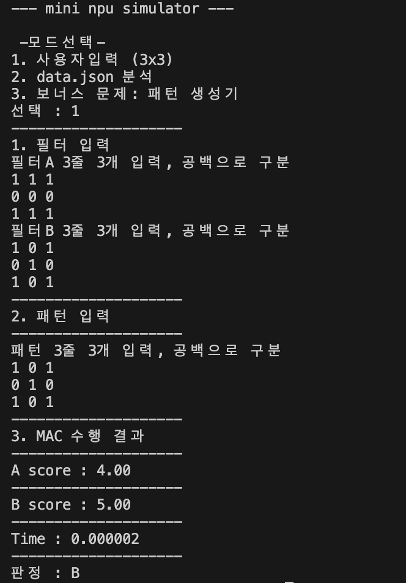
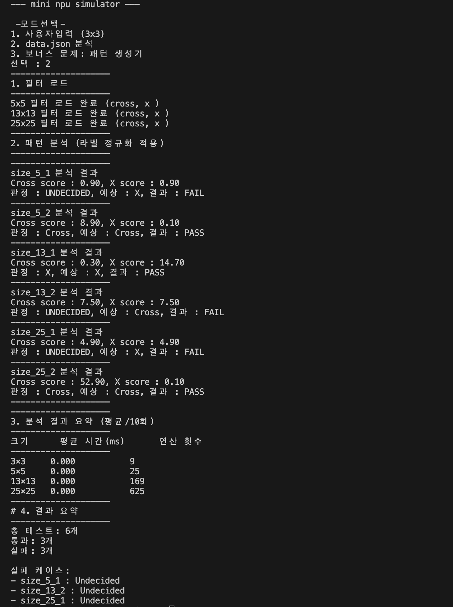

# Mini NPU Simulator

이 프로젝트는 MAC(Multiply-Accumulate) 연산의 핵심 원리를 직접 구현한 Python 콘솔 애플리케이션입니다. 입력 패턴과 필터를 2차원 숫자 배열로 표현해 `Cross`와 `X` 패턴을 판별하고, 크기별 연산 시간을 직접 측정합니다.

## 1. 미션 소개

우리는 시각적으로 `십자가`와 `X` 모양을 쉽게 구별하지만, 컴퓨터는 숫자 데이터만 이해합니다. 이 프로젝트는 2차원 숫자 배열로 변환된 패턴을 필터와 비교해 유사도를 계산하는 방식으로 패턴 인식을 수행합니다.

- `Cross` 필터와 `X` 필터를 정의
- 입력 패턴과 필터의 같은 위치 요소를 곱한 뒤 모두 더함
- 이 과정을 MAC 연산이라고 부름
- 3×3, 5×5, 13×13, 25×25의 다양한 크기를 처리

## 2. 주요 기능

### Mode 1: 사용자 입력 모드 (3×3)
   - 필터 A, 필터 B, 패턴을 콘솔에서 한 줄씩 입력
   - 두 필터의 MAC 점수를 계산
   - 평균 연산 시간(ms)을 측정
   - 판정 결과 출력: A, B, 또는 UNDECIDED



### Mode 2: JSON 분석 모드 (`data.json`)
   - `data.json`에서 필터와 패턴을 로드
   - `size_5`, `size_13`, `size_25` 크기의 필터 처리
   - 각 패턴을 `Cross` 또는 `X`로 판정
   - `expected` 라벨과 비교하여 PASS/FAIL 출력
   - 크기별 MAC 연산 시간(ms)과 연산 횟수(N²) 표 출력
   - 전체 테스트 수, 통과 수, 실패 수, 실패 케이스 요약 출력



## 3. 개발 환경

- Python 3.8 이상
- 외부 라이브러리 사용 금지
- 허용 라이브러리: `json`, `time`

## 4. 실행 방법

```bash
python main.py
```

실행 후 아래 중 하나를 선택합니다.

- `1`: 사용자 입력 모드 (3×3)
- `2`: `data.json` 분석 모드

## 5. 구현 요약

### 5.1 라벨 정규화

프로그램 내부는 `Cross`와 `X` 두 가지 표준 라벨을 사용합니다.
- `+` → `Cross`
- `cross` → `Cross`
- `x` → `X`
- `X` → `X`

이 정규화는 `expected` 값과 `data.json` 내 필터 키를 일관되게 비교하기 위해 필수입니다.

### 5.2 MAC 연산 구현

MAC 연산은 외부 라이브러리 없이 반복문으로 직접 구현했습니다.
- 두 행렬의 같은 위치 요소를 곱함
- 곱셈 결과를 누적하여 점수를 계산
- 반환 값은 `float`형 점수

### 5.3 입력 검증

3×3 사용자 입력 모드에서는 아래를 체크합니다.
- 각 줄에 숫자가 3개인지
- 전체 행 개수가 3개인지
- 숫자 파싱 오류 여부

입력 오류가 발생하면, 사용자에게 안내 메시지를 출력하고 재입력을 유도합니다.

### 5.4 epsilon 기반 점수 비교

부동소수점 오차를 고려해 점수 비교에 허용오차를 적용합니다.
- `abs(score_a - score_b) < 1e-9` 이면 동점으로 간주
- 동점인 경우 판정은 `UNDECIDED`

이 정책은 부동소수점 계산 결과가 아주 작은 차이를 보일 때 잘못된 판정을 피하게 합니다.

## 6. 결과 리포트

### 6.1 실패 원인 분석

이 프로젝트에서 실패가 발생한다면, 주로 다음 세 가지 원인으로 분류할 수 있습니다.
- 데이터/스키마 문제: `data.json`에서 필터 크기 또는 패턴 크기가 일치하지 않음
- 로직 문제: MAC 연산이나 라벨 정규화가 올바르게 구현되지 않음
- 수치 비교 문제: 부동소수점 차이를 동점으로 처리하지 않아 판정이 달라짐

프로그램은 `data.json` 분석 중 개별 케이스별로 FAIL을 처리하며, 한 건의 오류가 전체 실행을 중단시키지 않습니다.

만약 실패가 0개라면, 그 이유는 다음과 같습니다.
- `expected`와 필터 키를 `Cross`/`X`로 일관되게 정규화했기 때문에 라벨 비교 오류가 발생하지 않음
- 동일 위치 곱셈 누적 방식을 정확히 구현해 MAC 점수가 올바르게 계산됨
- `epsilon` 기반 비교 정책으로 부동소수점 미세 차이로 인한 잘못된 판정이 차단됨

### 6.2 시간 복잡도 분석

MAC 연산은 두 행렬의 같은 위치 요소를 모두 비교하기 때문에 연산 횟수는 `N×N`, 즉 `O(N²)`입니다.
- 3×3 필터는 9개의 곱셈
- 5×5 필터는 25개의 곱셈
- 13×13 필터는 169개의 곱셈
- 25×25 필터는 625개의 곱셈

이 프로젝트에서 크기가 커질수록 평균 연산 시간이 기하급수적으로 증가하는 이유는 연산량 자체가 N²에 비례하기 때문입니다. 크기가 두 배가 되면 연산 횟수는 네 배로 늘어납니다.

또한 성능 분석은 각 크기별 MAC 연산을 최소 10회 반복 측정하여 평균 시간을 계산합니다. 이 방식은 단일 실행 시점의 변동성을 줄이고, I/O 시간을 배제한 순수 연산 시간을 비교하는 데 적합합니다.

## 7. 재현성

### 모드 1: 3×3 사용자 입력 예시

- 필터 A: 0 1 0 / 1 1 1 / 0 1 0
- 필터 B: 1 0 1 / 0 1 0 / 1 0 1
- 패턴: 1 0 1 / 0 1 0 / 1 0 1

예상 출력:
- A 점수: 낮음
- B 점수: 높음
- 판정: B
- 평균 연산 시간 표시

### 모드 2: `data.json` 분석

- `size_5`, `size_13`, `size_25` 필터 로드
- 패턴별 `Cross/X/UNDECIDED` 판정
- PASS/FAIL 결과 출력
- 전체 테스트 수/통과 수/실패 수 요약
- 실패 케이스가 있을 경우 원인 요약

## 8. 파일 구조

- `main.py`: 메인 실행 파일
- `data.json`: 필터 및 패턴 테스트 데이터
- `README.md`: 실행 방법 및 결과 리포트

## 9. 참고

이 프로젝트는 AI 전용 칩(NPU)이 왜 MAC 연산을 중요하게 다루는지 이해하는 데 초점을 두고 있습니다. 작은 크기의 필터에서부터 큰 크기까지 직접 구현해보면서 연산량과 성능의 관계를 체감할 수 있도록 설계되었습니다.
