# 프로젝트 목표
- 개발 환경 세팅하고 과정과 결과를 문서화 하기
- 어디에서나 동일한 환경에서 실행 가능하게 만들기
- 터미널, docker, git등 도구 직접 다뤄보기

# 실행 환경
- OS : Sequoia 15.7.5
- Shell : zsh
- Git : 2.54
- Docker : 28.5.2
- vscode : 1.112.0

# 수행 체크리스트
- [x] 터미널 기본 조작 및 폴더 구성
- [x] 권한 변경 실습
- [x] Docker 설치/점검
- [x] hello-world 실행
- [x] Dockerfile 빌드/실행
- [x] 포트 매핑 접속(2회)
- [x] 바인드 마운트 반영
- [x] 볼륨 영속성
- [x] Git 설정 + VSCode GitHub 연동

# 수행 로그
터미널 조작

``` 
email@c4r2s3 Codyssey % pwd 
/Users/email/Documents/Codyssey 
```

``` 
email@c4r2s3 Codyssey % ls -a 
 .		..		.git		1주차		README.md 
 ```

```
email@c4r2s3 ~ % ls  
Desktop		Downloads	Movies		Pictures
Documents	Library		Music		Public
email@c4r2s3 ~ % cd Documents 
```

```
email@c4r2s3 Documents % mkdir test
email@c4r2s3 Documents % ls
Codyssey	test
```

```
email@c4r2s3 test % touch test.md
email@c4r2s3 test % ls
test.md	test3
```

```
email@c4r2s3 test % cp test.md test3
email@c4r2s3 test % cd test3 
email@c4r2s3 test3 % ls
test.md
```

```
email@c4r2s3 test % mv test.md test3
email@c4r2s3 test % ls
test3
```

```
email@c4r2s3 test3 % cat test.md 
test%  
```

```
email@c4r2s3 test3 % rm test.md 
email@c4r2s3 test3 % ls
```

```
email@c4r2s3 Documents % rm -r test2
email@c4r2s3 Documents % ls
Codyssey	test
```

권한 실습

```
email@c4r2s3 test % ls -l
total 0
-rw-r--r--  1 email  email   0  7 28 17:36 test.md
drwxr-xr-x  2 email  email  64  7 28 17:08 test3
```

```
email@c4r2s3 test % ls -l
total 0
--w-------  1 email  email   0  7 28 17:36 test.md
drwxr-xr-x  2 email  email  64  7 28 17:08 test3
```

```
email@c4r2s3 test % chmod -w test.md 
email@c4r2s3 test % ls -l
total 0
----------  1 email  email   0  7 28 17:36 test.md
drwxr-xr-x  2 email  email  64  7 28 17:08 test3
```

```
email@c4r2s3 test % chmod -r test3
email@c4r2s3 test % ls -l
total 0
----------  1 email  email   0  7 28 17:36 test.md
d-wx--x--x  2 email  email  64  7 28 17:08 test3
email@c4r2s3 test %  chmod -w test3
email@c4r2s3 test % ls -l
total 0
----------  1 email  email   0  7 28 17:36 test.md
d--x--x--x  2 email  email  64  7 28 17:08 test3
```

# 권한 의미
- 소유자, 그룹, 기타 사용자
- 읽기 r=4, 쓰기 w=2, 실행 x=1
- 755 (모든, 읽기실행, 읽기실행) 소유자 모든 권한 타인은 읽고실행만, 644 (읽기쓰기, 읽기, 읽기) 소유자 읽고실행만 타인은 읽기만

# 트러블 슈팅

```
문제 : git push시 발생함 : src refspec master does not match any 
원인 : 내 정보 등록 안해서 주소 못찾는듯
해결 : git config user.name, git config user.email 등록 
```

```
문제 : docker run -it ubuntu bash 로 컨테이너 진입후 나가는 방법 모르겠음
해결 : 컨테이너 종료하고 나올땐 ctrl + d, 유지하고 싶을땐 ctrl + p > q 순서대로
```

```
문제 : docker build -t my-nginx:v1 실행시 // ERROR: docker: 'docker buildx build' requires 1 argument
Usage:  docker buildx build [OPTIONS] PATH | URL | - // 발생
원인 : PATH 못찾는거 같다
해결 : 마지막에 . 빠짐 ( 상대경로로 현재 경로 명시 )
```
# Git 설정 및 Github 연동

```
email@c4r2s3 Codyssey % git config --list
credential.helper=osxkeychain
core.repositoryformatversion=0
core.filemode=true
core.bare=false
core.logallrefupdates=true
core.ignorecase=true
core.precomposeunicode=true
remote.origin.url=https://github.com/Sanghwa-Na/Codyssey.git
remote.origin.fetch=+refs/heads/*:refs/remotes/origin/*
branch.main.remote=origin
branch.main.merge=refs/heads/main
branch.main.vscode-merge-base=origin/main
user.name=Sanghwa-Na
user.email=email@gmail.com
```

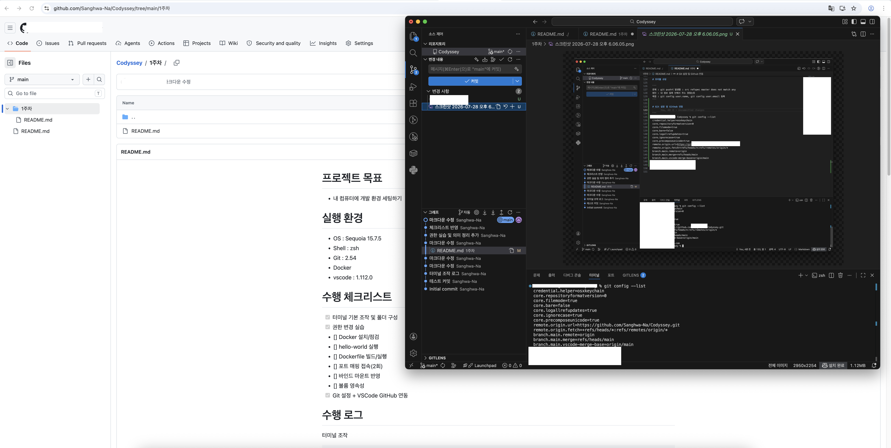

# Docker 설치 및 기본점검

```
email@c4r2s3 ~ % docker --version
Docker version 28.5.2, build ecc6942
```
 
```
email@c4r2s3 ~ % docker info
Client:
 Version:    28.5.2
 Context:    orbstack
 Debug Mode: false
 Plugins:
  buildx: Docker Buildx (Docker Inc.)
    Version:  v0.29.1
    Path:     /Users/email/.docker/cli-plugins/docker-buildx
  compose: Docker Compose (Docker Inc.)
    Version:  v2.40.3
    Path:     /Users/email/.docker/cli-plugins/docker-compose

Server:
 Containers: 0
  Running: 0
  Paused: 0
  Stopped: 0
 Images: 0
 Server Version: 28.5.2
 Storage Driver: overlay2
  Backing Filesystem: btrfs
  Supports d_type: true
  Using metacopy: false
  Native Overlay Diff: true
  userxattr: false
 Logging Driver: json-file
 Cgroup Driver: cgroupfs
 Cgroup Version: 2
 Plugins:
  Volume: local
  Network: bridge host ipvlan macvlan null overlay
  Log: awslogs fluentd gcplogs gelf journald json-file local splunk syslog
 CDI spec directories:
  /etc/cdi
  /var/run/cdi
 Swarm: inactive
 Runtimes: io.containerd.runc.v2 runc
 Default Runtime: runc
 Init Binary: docker-init
 containerd version: 1c4457e00facac03ce1d75f7b6777a7a851e5c41
 runc version: d842d7719497cc3b774fd71620278ac9e17710e0
 init version: de40ad0
 Security Options:
  seccomp
   Profile: builtin
  cgroupns
 Kernel Version: 6.17.8-orbstack-00308-g8f9c941121b1
 Operating System: OrbStack
 OSType: linux
 Architecture: x86_64
 CPUs: 6
 Total Memory: 15.67GiB
 Name: orbstack
 ID: 40a9a249-54be-4baf-8292-e57c65b9751c
 Docker Root Dir: /var/lib/docker
 Debug Mode: false
 Experimental: false
 Insecure Registries:
  ::1/128
  127.0.0.0/8
 Live Restore Enabled: false
 Product License: Community Engine
 Default Address Pools:
   Base: 192.168.97.0/24, Size: 24
   Base: 192.168.107.0/24, Size: 24
   Base: 192.168.117.0/24, Size: 24
   Base: 192.168.147.0/24, Size: 24
   Base: 192.168.148.0/24, Size: 24
   Base: 192.168.155.0/24, Size: 24
   Base: 192.168.156.0/24, Size: 24
   Base: 192.168.158.0/24, Size: 24
   Base: 192.168.163.0/24, Size: 24
   Base: 192.168.164.0/24, Size: 24
   Base: 192.168.165.0/24, Size: 24
   Base: 192.168.166.0/24, Size: 24
   Base: 192.168.167.0/24, Size: 24
   Base: 192.168.171.0/24, Size: 24
   Base: 192.168.172.0/24, Size: 24
   Base: 192.168.181.0/24, Size: 24
   Base: 192.168.183.0/24, Size: 24
   Base: 192.168.186.0/24, Size: 24
   Base: 192.168.207.0/24, Size: 24
   Base: 192.168.214.0/24, Size: 24
   Base: 192.168.215.0/24, Size: 24
   Base: 192.168.216.0/24, Size: 24
   Base: 192.168.223.0/24, Size: 24
   Base: 192.168.227.0/24, Size: 24
   Base: 192.168.228.0/24, Size: 24
   Base: 192.168.229.0/24, Size: 24
   Base: 192.168.237.0/24, Size: 24
   Base: 192.168.239.0/24, Size: 24
   Base: 192.168.242.0/24, Size: 24
   Base: 192.168.247.0/24, Size: 24
   Base: fd07:b51a:cc66:d000::/56, Size: 64
```

# Docker 기본 운영 명령 수행

```
email@c4r2s3 ~ % docker pull ubuntu
Using default tag: latest
latest: Pulling from library/ubuntu
ed819469700f: Pull complete 
a3679419df18: Pull complete 
Digest: sha256:3131b4cc82a783df6c9df078f86e01819a13594b865c2cad47bd1bca2b7063bb
Status: Downloaded newer image for ubuntu:latest
docker.io/library/ubuntu:latest
```
```
email@c4r2s3 ~ % docker images
REPOSITORY   TAG       IMAGE ID       CREATED       SIZE
ubuntu       latest    de7345b16e94   2 weeks ago   100MB
```

```
email@c4r2s3 ~ % docker container ps
CONTAINER ID   IMAGE     COMMAND   CREATED   STATUS    PORTS     NAMES
```

```
email@c4r2s3 ~ % docker container ps -a
CONTAINER ID   IMAGE     COMMAND       CREATED          STATUS                      PORTS     NAMES
7461312cbc65   ubuntu    "/bin/bash"   26 seconds ago   Exited (0) 25 seconds ago             confident_hypatia
ca492e5ab6ac   ubuntu    "/bin/bash"   3 minutes ago    Exited (0) 3 minutes ago              beautiful_jemison
```

```
email@c4r2s3 ~ % docker run --name test ubuntu
email@c4r2s3 ~ % docker ps
CONTAINER ID   IMAGE     COMMAND   CREATED   STATUS    PORTS     NAMES
email@c4r2s3 ~ % docker ps -a
CONTAINER ID   IMAGE     COMMAND       CREATED          STATUS                      PORTS     NAMES
3e37f8bd2bdf   ubuntu    "/bin/bash"   22 seconds ago   Exited (0) 21 seconds ago             test
7461312cbc65   ubuntu    "/bin/bash"   7 minutes ago    Exited (0) 7 minutes ago              confident_hypatia
ca492e5ab6ac   ubuntu    "/bin/bash"   10 minutes ago   Exited (0) 10 minutes ago             beautiful_jemison
```

```
email@c4r2s3 ~ % docker stop container test
test
```

```
email@c4r2s3 ~ % docker logs test 
```

```
email@c4r2s3 ~ % docker stats test

CONTAINER ID   NAME      CPU %     MEM USAGE / LIMIT   MEM %     NET I/O   BLOCK I/O   PIDS 
3e37f8bd2bdf   test      0.00%     0B / 0B             0.00%     0B / 0B   0B / 0B     0 
```

# 컨테이너 실행 실습
 
```
email@c4r2s3 ~ % docker run hello-world
Unable to find image 'hello-world:latest' locally
latest: Pulling from library/hello-world
4f55086f7dd0: Pull complete 
Digest: sha256:c3cbe1cc1aa588a64951ac6286e0df7b27fe2e6324b1001c619bb358770c0178
Status: Downloaded newer image for hello-world:latest

Hello from Docker!
This message shows that your installation appears to be working correctly.

To generate this message, Docker took the following steps:
 1. The Docker client contacted the Docker daemon.
 2. The Docker daemon pulled the "hello-world" image from the Docker Hub.
    (amd64)
 3. The Docker daemon created a new container from that image which runs the
    executable that produces the output you are currently reading.
 4. The Docker daemon streamed that output to the Docker client, which sent it
    to your terminal.

To try something more ambitious, you can run an Ubuntu container with:
 $ docker run -it ubuntu bash

Share images, automate workflows, and more with a free Docker ID:
 https://hub.docker.com/

For more examples and ideas, visit:
 https://docs.docker.com/get-started/

```

```
email@c4r2s3 ~ % docker images hello-world
REPOSITORY    TAG       IMAGE ID       CREATED        SIZE
hello-world   latest    e2ac70e7319a   4 months ago   10.1kB
```

```
root@a72efda5d53f:/# ls
bin   dev  home  lib64  mnt  proc  run   srv  tmp  var
boot  etc  lib   media  opt  root  sbin  sys  usr
```

```
root@a72efda5d53f:/# echo hello docker
hello docker
```

```
email@c4r2s3 ~ % docker exec dazzling_williams ls
bin
boot
dev
etc
home
lib
lib64
media
mnt
opt
proc
root
run
sbin
srv
sys
tmp
usr
var
```

```
email@c4r2s3 ~ % docker attach dazzling_williams                          
    
root@a72efda5d53f:/# ls
bin   dev  home  lib64  mnt  proc  run   srv  tmp  var
boot  etc  lib   media  opt  root  sbin  sys  usr
```

- attach : 실행 중인 컨테이너에 접속, exec : 접속 하지 않고 외부에서 결과 확인

# 커스텀 Dockerfile 제작 실습

```
email@c4r2s3 my-nginx % touch Dockerfile
email@c4r2s3 my-nginx % vim Dockerfile 
```
```
1. 베이스 이미지 선택 (공식 NGINX 이미지)
FROM nginx:latest

2. 이미지 메타정보 추가
LABEL maintainer="your-name"
LABEL description="커스텀 NGINX 웹 서버"

3. 기본 HTML 파일을 내가 만든 파일로 교체
    NGINX의 기본 웹 루트 경로: /usr/share/nginx/html/
COPY app/index.html /usr/share/nginx/html/index.html

4. 컨테이너가 사용할 포트 명시 (문서화 목적)
EXPOSE 80
```

```
email@c4r2s3 my-nginx % docker build -t my-nginx:v1 .

중략 
=> [2/2] COPY app/index.html /usr/share/nginx/html/index.html             0.4s
 => exporting to image                                                     0.2s
 => => exporting layers                                                    0.1s
 => => writing image sha256:68a6e61882f13575bb004b2f40f58dc3835044dc88111  0.0s
 => => naming to docker.io/library/my-nginx:v1    

```

```
email@c4r2s3 my-nginx % docker run -d \
  --name my-nginx-container \
  -p 8080:80 \
  my-nginx:v1
aedafd9a09699f89d034f0f16a8ad21fd5382aae80a010da572c418a9c685314

email@c4r2s3 my-nginx % docker ps
CONTAINER ID   IMAGE         COMMAND                   CREATED          STATUS          PORTS                                     NAMES
aedafd9a0969   my-nginx:v1   "/docker-entrypoint.…"   21 seconds ago   Up 21 seconds   0.0.0.0:8080->80/tcp, [::]:8080->80/tcp   my-nginx-container
```

빌드 명령 및 결과 ( 포트 매핑 및 접속 증거 )
```
email@c4r2s3 my-nginx % curl http://localhost:8080
<!DOCTYPE html>
<html lang="ko">
<head>
  <meta charset="UTF-8">
  <title>My Custom NGINX</title>
</head>
<body>
  <h1>🚀 나의 커스텀 웹 서버입니다!</h1>
  <p>Docker + NGINX로 만든 첫 번째 컨테이너</p>
</body>
</html>
```

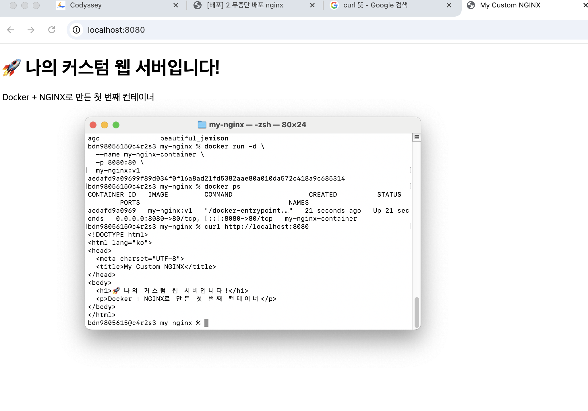


- 선택한 베이스 이미지 및 이유 
   nginx 사용이유 : 간편한게 hello world 용으로 딱임

-  커스텀 포인트 각각의 목적 설명
   touch, vim 으로 터미널에서 파일 만들고 커스텀 페이지 작성함

   email@c4r2s3 my-nginx % docker build -t my-nginx:v1 . # :v1 으로 버전관리함

   --name 으로 직관적인 이름 붙임

    -p 8080:80, 8080 포트 사용하는 내 컴퓨터를 80포트 사용하는 컨테이너에 매핑

   1. 베이스 이미지 선택 (공식 NGINX 이미지)
      FROM nginx:latest

   2. 이미지 메타정보 추가
      LABEL maintainer="your-name"
      LABEL description="커스텀 NGINX 웹 서버"

   3. 기본 HTML 파일을 내가 만든 파일로 교체
         NGINX의 기본 웹 루트 경로: /usr/share/nginx/html/
      COPY app/index.html /usr/share/nginx/html/index.html

   4. 컨테이너가 사용할 포트 명시 (문서화 목적)
      EXPOSE 80


# Docker 볼륨 영속성 검증

볼륨 생성

```
email@c4r2s3 test % docker volume create my-web-volume
my-web-volume
email@c4r2s3 test % docker volume ls
DRIVER    VOLUME NAME
local     my-web-volume
```
볼륨 연결하여 컨테이너 실행

```
email@c4r2s3 test % docker run -d \
  --name volume-test \
  -p 8081:80 \
  -v my-web-volume:/usr/share/nginx/html \
  nginx:latest

a62c450~ 이 볼륨 연결한 컨테이너

email@c4r2s3 test % docker ps
CONTAINER ID   IMAGE          COMMAND                   CREATED              STATUS              PORTS                                     NAMES
a62c4504be73   nginx:latest   "/docker-entrypoint.…"   About a minute ago   Up About a minute   0.0.0.0:8081->80/tcp, [::]:8081->80/tcp   volume-test
aedafd9a0969   my-nginx:v1    "/docker-entrypoint.…"   52 minutes ago       Up 52 minutes       0.0.0.0:8080->80/tcp, [::]:8080->80/tcp   my-nginx-container
```
볼륨에 데이터 저장

```
email@c4r2s3 test % docker exec volume-test \
  sh -c "echo '볼륨 영속성 테스트 데이터' > /usr/share/nginx/html/test.txt"

email@c4r2s3 test % docker exec volume-test cat /usr/share/nginx/html/test.txt
볼륨 영속성 테스트 데이터
```

컨테이너 삭제

```
email@c4r2s3 test % docker stop volume-test
volume-test
email@c4r2s3 test % docker rm volume-test
volume-test
email@c4r2s3 test % docker ps -a
CONTAINER ID   IMAGE         COMMAND                   CREATED          STATUS                      PORTS                                     NAMES
aedafd9a0969   my-nginx:v1   "/docker-entrypoint.…"   58 minutes ago   Up 58 minutes               0.0.0.0:8080->80/tcp, [::]:8080->80/tcp   my-nginx-container
e7a8ef472cf7   hello-world   "/hello"                  25 hours ago     Exited (0) 25 hours ago                                               gallant_swartz
a72efda5d53f   ubuntu        "bash"                    26 hours ago     Exited (137) 25 hours ago                                             dazzling_williams
27e6870451f0   hello-world   "ubuntu bash"             26 hours ago     Created                                                               amazing_pike
3a24a15ae846   hello-world   "/hello"                  26 hours ago     Exited (0) 26 hours ago                                               confident_lamport
3e37f8bd2bdf   ubuntu        "/bin/bash"               26 hours ago     Exited (0) 26 hours ago                                               test
7461312cbc65   ubuntu        "/bin/bash"               26 hours ago     Exited (0) 26 hours ago                                               confident_hypatia
ca492e5ab6ac   ubuntu        "/bin/bash"               26 hours ago     Exited (0) 26 hours ago                                     
```

같은 볼륨으로 새 컨테이너 실행

```
docker run -d \
  --name volume-test2 \
  -p 8082:80 \
  -v my-web-volume:/usr/share/nginx/html \
  nginx:latest
```

이전 컨테이너에서 만든 파일이 삭제 되지 않고 그대로 있음

```
email@c4r2s3 test % docker exec volume-test2 cat /usr/share/nginx/html/test.txt
볼륨 영속성 테스트 데이터
```

- 볼륨이 없으면 컨테이너 삭제 시 데이터도 삭제됨
   볼륨이 있으니 삭제해도 데이터가 유지됨

```
볼륨 정보

email@c4r2s3 test % docker volume inspect my-web-volume
[
    {
        "CreatedAt": "2026-07-29T21:17:05+09:00",
        "Driver": "local",
        "Labels": null,
        "Mountpoint": "/var/lib/docker/volumes/my-web-volume/_data",
        "Name": "my-web-volume",
        "Options": null,
        "Scope": "local"
    }
]
```

# 바인드 마운트 실행

```
bdn9805615@c4r2s3 Documents % docker run -it --mount type=bind,source="$(pwd)/bindmount",target=/app ubuntu

root@24046e6faec0:/# ls
app  boot  etc   lib    media  opt   root  sbin  sys  usr
bin  dev   home  lib64  mnt    proc  run   srv   tmp  var

root@24046e6faec0:/# cat /app/test.txt
bind moun test

root@24046e6faec0:/# echo "edit from container" >> /app/test.txt
bdn9805615@c4r2s3 Documents % cat bindmount/test.txt
bind moun test
edit from container

```

# Docker Compose 기초

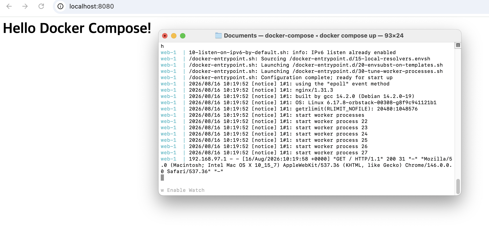

- docker run의 복잡한 옵션들을 docker-compose.yml 파일 하나에 명시합니다 
- 문서화 효과: 인프라 구성이 문서화되어, 누구나 동일한 환경을 즉시 재현할 수 있습니다
- 유지보수: 설정 변경 이력을 Git으로 추적할 수 있어 협업 및 관리가 매우 용이합니다.

# Compose Multi Container

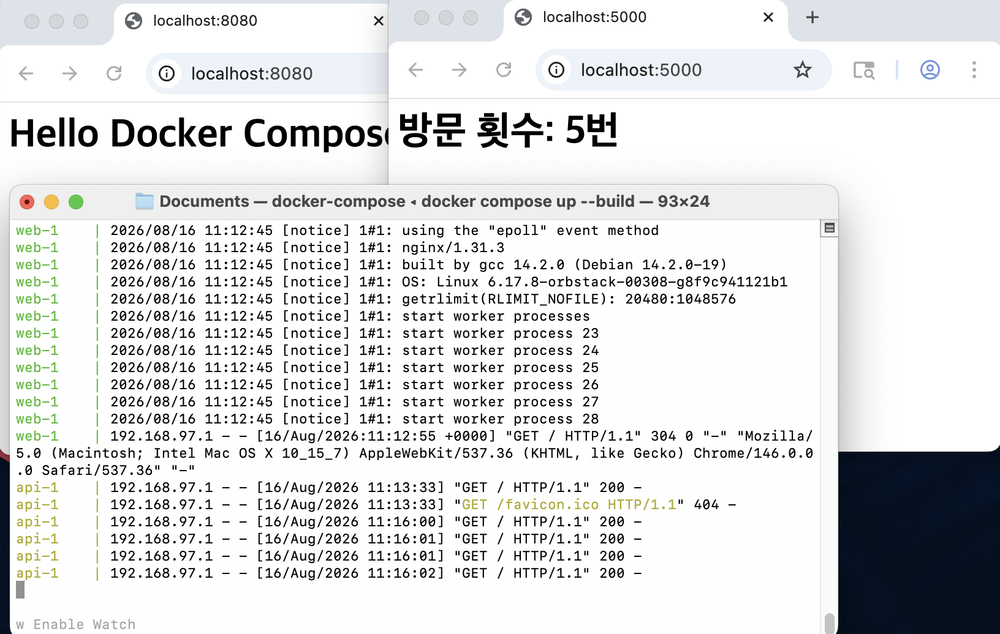
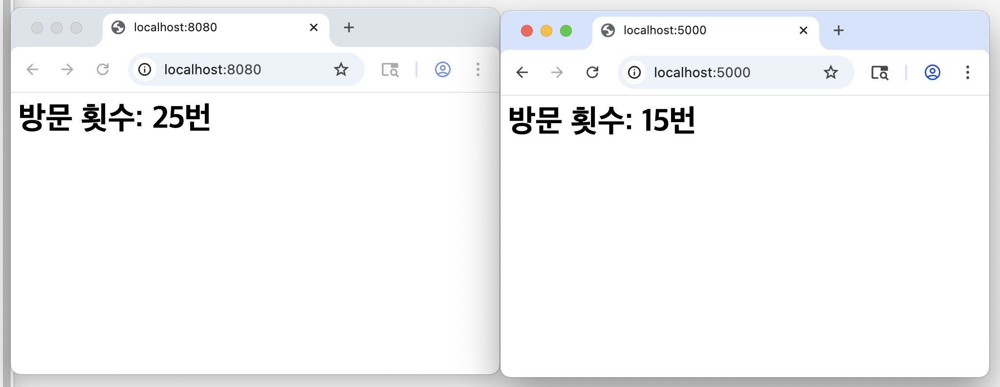
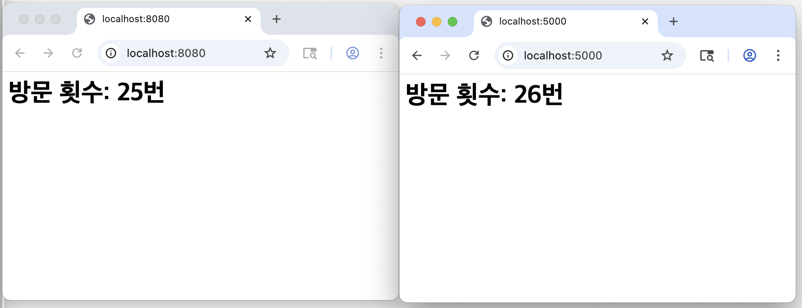

- Compose는 프로젝트별 전용 가상 네트워크를 자동으로 생성하여 컨테이너들을 격리/연결합니다

- 서비스 디스커버리: IP 주소를 외울 필요 없이, docker-compose.yml에 정의한 서비스 이름(예: db, web)을 도메인 이름처럼 사용하여 서로를 찾아 통신할 수 있습니다

# Compose 운영 명령어

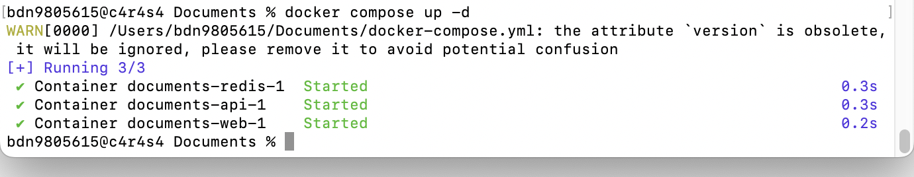
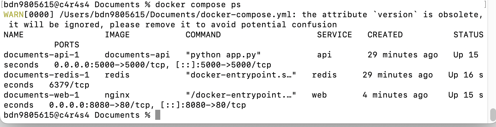
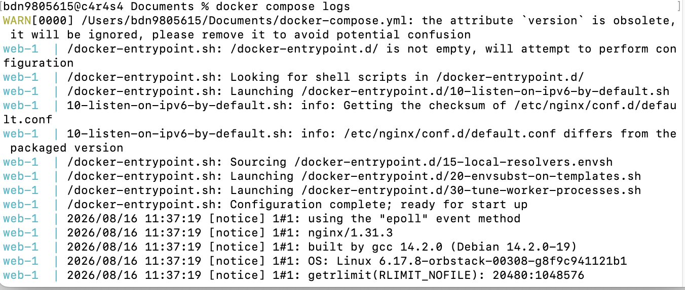
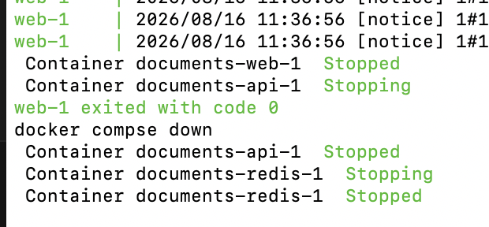

- ps: 서비스 구동 상태 확인
- logs: 실시간 에러 진단 및 모니터링
- up/down: 안정적인 서비스 시작 및 깔끔한 리소스 정리(네트워크/컨테이너)

# 환경 변수 활용

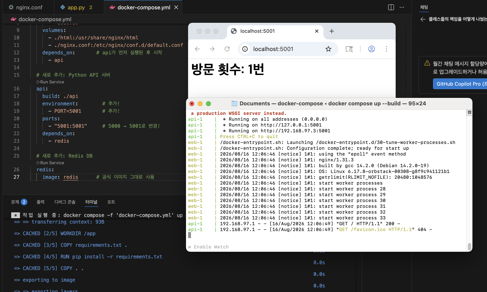

- 애플리케이션의 로직(코드)과 외부 설정값(포트, DB 주소, API 키)을 분리합니다
- 소스코드 내에 민감 정보를 하드코딩하지 않아 보안성이 강화됩니다
- 동일한 이미지를 환경 변수만 바꿔가며 개발, 테스트, 운영 환경에 맞춰 즉시 배포할 수 있습니다
